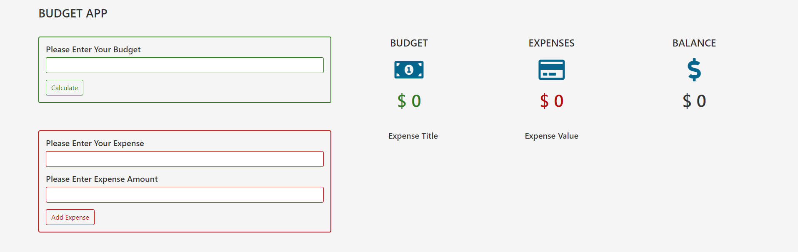

# JavaScript Budget App

This is a simple budget app built using html,css and vanilla js. The basic functions performed by this app is adding budget, adding expenses, displaying the expense list and calculating the balance.

## Table of contents

- [Overview](#overview)
  - [Screenshot](#screenshot)
  - [Links](#links)
- [My process](#my-process)
  - [Built with](#built-with)
  - [What I learned](#what-i-learned)
  - [Continued development](#continued-development)
- [Author](#author)

## Overview

### Screenshot




### Links

- Live Site URL: [https://kaveeshagim.github.io/qr-code-component/](https://kaveeshagim.github.io/qr-code-component/)

## My process

### Built with

- HTML5
- CSS custom properties
- Bootstrap 5
- JQuery
- Mobile-first workflow

### What I learned

Through this project i learned how to use javascript classes and constructors. I also learned a new function named reduce() which is basically used to get the sum of all the values in a list.

To see how you can add code snippets, see below:

```js
if(this.itemList.length > 0){
    total = this.itemList.reduce(function(acc,curr){
    console.log(`total is ${acc} and the current value is ${curr.amount}`);
    acc += curr.amount;
    return acc;
    },0)
}
```


### Continued development

I want to further make improvements in the ui and maybe integrate a database to store the data.

## Author

- Github - [https://github.com/kaveeshagim](https://github.com/kaveeshagim)
- Instagram - [@codingwcn](https://www.instagram.com/codingwcn)

